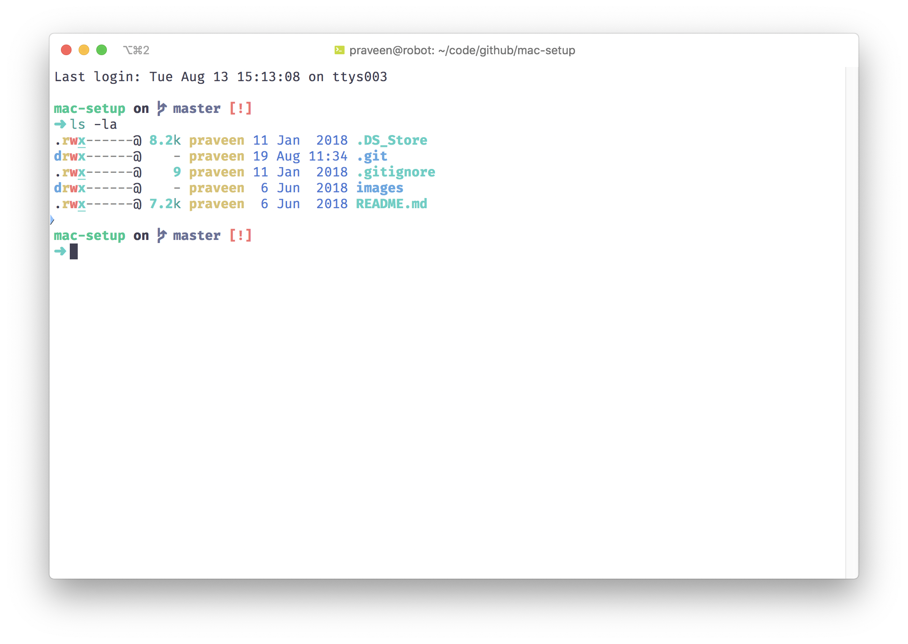
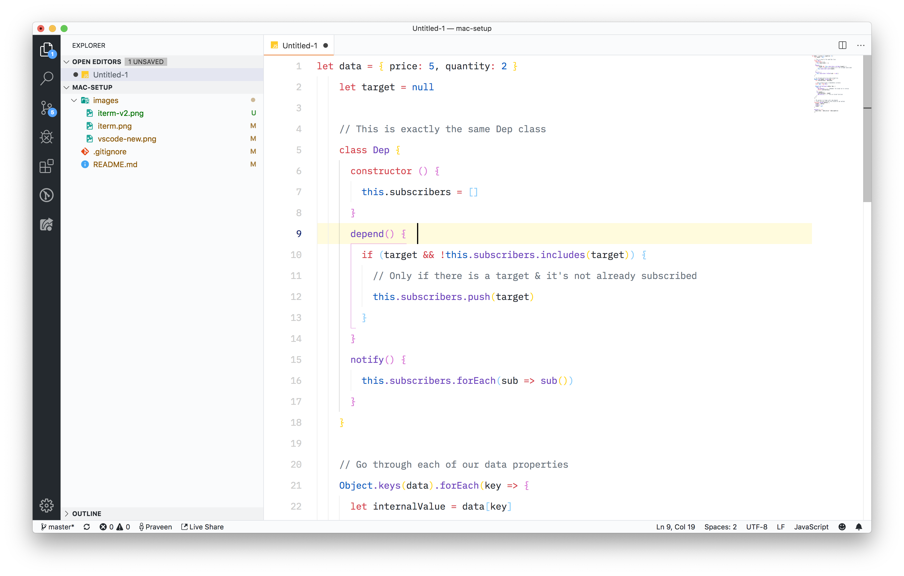

# MacBook Setup

Some people have asked me questions about my system setup. Which apps do I use and with what settings. Putting together this document to help answer those questions for anyone who wants a usable, productive & beautiful development experience.

If you find something useful here, free free to share and ⭐️ the repo. Also, if you feel I am missing interesting things, put it on the [issues](https://github.com/praveenpuglia/mac-setup/issues) and I'll definitely try it out.

---

## Update

I have moved to from using a mix of dark and light themes to totally using light theme everywhere. Earlier, switching back and forth between the browser and the code editor / terminal gave my eyes nightmares.

Switching to light theme as really helped my eyes and if you are into heavy front-end development, you should probably consider doing the same for a test drive and see if it helps.

## Terminal

I use [iTerm2](https://www.iterm2.com/) with the following settings for a pleasant terminal eperience.

- 🎨 Color Theme : [Night Owlish Light](https://github.com/praveenpuglia/night-owlish-theme) - I made this myself because I didn't like any light theme out there. On a MBP, It gives amazing contrast and doesn't give my eyes the pain.
- 🔠 Font : Moved to [Fira Code](https://github.com/tonsky/FiraCode), **15pt**, Anti Aliased.
- 🗄 List Files : [Exa](https://github.com/ogham/exa). With `alias ls=exa` in `.zshrc`.
- 🖥 Prompt : [Spaceship Prompt](https://github.com/denysdovhan/spaceship-prompt). Slightly heavier than my prev favourite, Pure Prompt but it looks amazing and has tons of customization.
- 🐚 Shell : [Zsh](http://www.zsh.org/) with [Oh My Zsh](https://github.com/robbyrussell/oh-my-zsh) & this [.zshconfig](https://github.com/praveenpuglia/dotfiles/blob/master/.zshrc)
- 📝 Shell Text Editor : [Micro](https://github.com/zyedidia/micro). Yeah! Skipping the Vim vs Emacs war altogether. 😎
- 🗂 Working Directory : ✅ Reuse previous session's directory.
- <kbd>New</kbd> Minimal Mode in iTerm. Makes the tabs look cleaner.

## Code Editor

.

Why?

- Because it's fast.
- It has great extensions.
- Also because I contributed to the CSS Language Service. So 🤟.

- 🎨 Color Theme: [GitHub Plus](https://marketplace.visualstudio.com/items?itemName=thenikso.github-plus-theme) : Has one of the best contrasts in light themes.
- 💅 Icon Theme : [Material Icon Theme ](https://marketplace.visualstudio.com/items?itemName=PKief.material-icon-theme)
- 🔠 Font : [IBM Plex Mono](https://fonts.google.com/specimen/IBM+Plex+Mono) - It's a surprisingly underestimated amazing coding font. Looks dope!

## Notes & To-dos

I recently switched to [Notion](https://www.notion.so/) and I don't think I am ever going back. I have tried gazillions of apps that help me do notes & todos but nothing has been this good. Try it out and you'll know why.

**UPDATE:** Couldn't afford to buy Notion. I miss it but have moved on to [Typora](https://typora.io/). It's not as fancy as Notion but it's the best Markdown editor I have ever found.

## Browsers

- Firefox Developer Edition 😌
- Chrome 🤩
- Safari 🙂
- Opera 🕵️‍♂️

I have completely made firefox my daily driver. It has evolved a lot in its recent versions. Love the containers.

I use the following extensions with their different browser counterparts. These are spread across different profiles.

- Awesome Screenshot
- ColorPick Eyedropper
- uBlock Origin
- Vue Devtools
- Octotree
- JSONView
- Allow-Control-Allow-Origin: \*
- Page Ruler

## Mail

I previously used Airmail beta but I have somehow never found a perfect mail app of my choice so I just resort to using the web counterparts now.

## Window Management

Window management on Mac sucks by default. I had tried [Spectacle](https://www.spectacleapp.com/) and the likes but really settled on to [Magnet](https://itunes.apple.com/in/app/magnet/id441258766?mt=12). Yes it's not free but it can't be cheaper than this. Magnet supports both keyboard shortcuts & mouse drags. It works with multiple screens too.

## Utilities

### Productivity

- [Station](https://getstation.com/) - When Franz came out, I was really happy that I wouldn't have to have 10 different applications open in the background or in browser tabs. I gradually got irritated of it because of tons of bugs it has.

Station is a great **and** superior alternative. It is smooth AF.

### Developer Utilities

- [Docker](https://www.docker.com/) : No need for introduction. Amazing piece of software. Why isn't the entire world dockerized yet? 🤔
- [Studio 3T](https://studio3t.com/) : For anything related to MongoDB 🍃.
- [Gas Mask](https://github.com/2ndalpha/gasmask): To quickly switch between different hosts configuration.

### General Purpose Utilities

- [KeepingYouAwake](https://github.com/newmarcel/KeepingYouAwake) : To prevent Mac from going into sleep. ☕️
- [Homebrew](https://brew.sh/) : I don't think I need to explain this. 🍻
- [GIF Brewery 3](http://gifbrewery.com/) : To quickly record screen and make high resolution, high quality GIFs out of that. 📹
- [Mounty](http://enjoygineering.com/mounty/) : To run NTFS (Windows) formatted HDDs on Mac. 💽
- [Enpass](https://www.enpass.io/): My password manager. Love it because of their pricing model and support on pretty much all platforms. Supports Touch ID.
