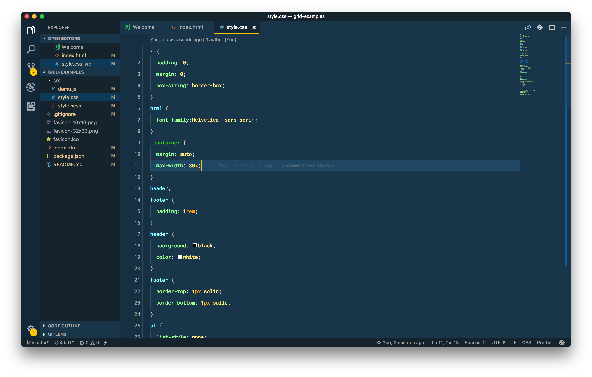

# MacBook Setup
Some people have asked me questions about my system setup. Which apps do I use and with what settings. Putting together this document to help answer those questions for anyone who wants a usable, productive & beautiful development experience. 

---

## Terminal

I use [iTerm2](https://www.iterm2.com/) with the following settings for a pleasant terminal eperience.

- 🎨 Color Theme : [iTerm2 Snazzy](https://github.com/sindresorhus/iterm2-snazzy)
- 🔠 Font : [Iosevka Term](https://be5invis.github.io/Iosevka/), **15pt**, Anti Aliased, 110% Vertical Character Spacing. I like narrow fonts on terminal.
- 🗄 List Files : [Exa](https://github.com/ogham/exa)
- 🖥 Prompt : [Pure Prompt](https://github.com/sindresorhus/pure). Minimal, Pretty, Useful.
- 🐚 Shell : [Zsh](http://www.zsh.org/) with [Oh My Zsh](https://github.com/robbyrussell/oh-my-zsh) & this [.zshconfig](https://github.com/praveenpuglia/dotfiles/blob/master/.zshrc)
- 📝 Shell Text Editor : [Micro](https://github.com/zyedidia/micro). Yeah! Skipping the Vim vs Emacs war altogether. 😎
- 🗂 Working Directory : ✅ Reuse previous session's directory.

## Visual Studio Code - Insiders

My favourite code editor and currently the only one I use. 💖
- 🎨 Color Theme : [Cobalt2 Theme Official](https://marketplace.visualstudio.com/items?itemName=wesbos.theme-cobalt2)
- 🔌 Extensions
    - [Angular Language Service](https://marketplace.visualstudio.com/items?itemName=Angular.ng-template)
    - [Debugger For Chrome](https://marketplace.visualstudio.com/items?itemName=msjsdiag.debugger-for-chrome)
    - [EditorConfig for VS Code](https://marketplace.visualstudio.com/items?itemName=EditorConfig.EditorConfig)
    - [ESLint](https://marketplace.visualstudio.com/items?itemName=dbaeumer.vscode-eslint)
    - [Git Lens](https://marketplace.visualstudio.com/items?itemName=eamodio.gitlens)
    - [IntelliSense for CSS class names](https://marketplace.visualstudio.com/items?itemName=Zignd.html-css-class-completion)
    - [JSON Tools](https://marketplace.visualstudio.com/items?itemName=eriklynd.json-tools)
    - [Path Intellisense](https://marketplace.visualstudio.com/items?itemName=christian-kohler.path-intellisense)
    - [Prettier](https://marketplace.visualstudio.com/items?itemName=esbenp.prettier-vscode)
    - [Rainbow Brackets](https://marketplace.visualstudio.com/items?itemName=2gua.rainbow-brackets)
    - [Settings Sync](https://marketplace.visualstudio.com/items?itemName=Shan.code-settings-sync)
    - [Text Pastry](https://marketplace.visualstudio.com/items?itemName=jkjustjoshing.vscode-text-pastry)
    - [TSLint](https://marketplace.visualstudio.com/items?itemName=eg2.tslint)
    - [TypeScript Hero](https://marketplace.visualstudio.com/items?itemName=rbbit.typescript-hero)
    - [Vetur](https://marketplace.visualstudio.com/items?itemName=octref.vetur)
    - [VS Code CSS Comments](https://marketplace.visualstudio.com/items?itemName=ashhitch.vs-code-css-comments)
- 💅 Icon Theme : Seti (Visual Studio Code) - Comes preinstalled.
- 🔠 Font : [Roboto Mono](https://fonts.google.com/specimen/Roboto+Mono)
- ⚙️ User Settings 
    ```json
    {
        "editor.fontFamily": "Roboto Mono",
        "editor.fontLigatures": true,
        "editor.fontSize": 13,
        "editor.lineHeight": 30,
        "editor.multiCursorModifier": "ctrlCmd",
        "editor.wordWrap": "on",
        "html.format.wrapAttributes": "force-aligned",
        "prettier.proseWrap": true,
        "prettier.singleQuote": true,
        "terminal.external.osxExec": "iTerm.app",
        "tslint.autoFixOnSave": true,
        "terminal.integrated.fontSize": 14,
        "terminal.integrated.fontFamily": "SF Mono"
    }
    ```


