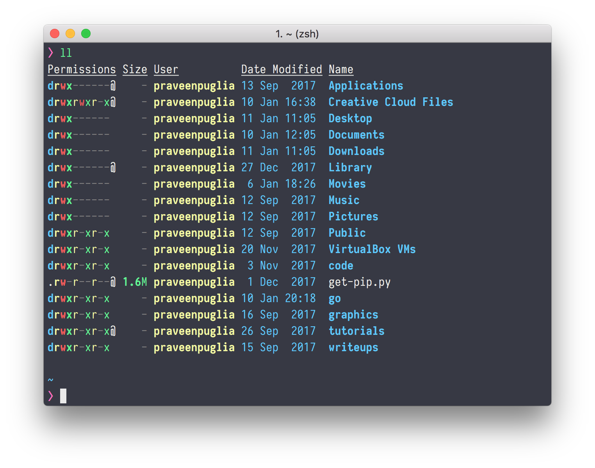

# MacBook Setup
Some people have asked me questions about my system setup. Which apps do I use and with what settings. Putting together this document to help answer those questions for anyone who wants a usable, productive & beautiful development experience. 

---

## Terminal

I use [iTerm2](https://www.iterm2.com/) with the following settings for a pleasant terminal eperience.

- 🗂 Working Directory : ✅ Reuse previous session's directory.
- 🎨 Color Theme : [iTerm2 Snazzy](https://github.com/sindresorhus/iterm2-snazzy)
- 🖥 Prompt : [Pure Prompt](https://github.com/sindresorhus/pure). Minimal, Pretty, Useful.
- 🔠 Font : [Iosevka Term](https://be5invis.github.io/Iosevka/), **15pt**, Anti Aliased, 110% Vertical Character Spacing. I like narrow fonts on terminal.
- 🐚 Shell : [Zsh](http://www.zsh.org/) with [Oh My Zsh](https://github.com/robbyrussell/oh-my-zsh) & this [.zshconfig](https://github.com/praveenpuglia/dotfiles/blob/master/.zshrc)
- 📝 Shell Text Editor : [Micro](https://github.com/zyedidia/micro). Yeah! Skipping the Vim vs Emacs war altogether. 😎
- 🗄 List Files : [Exa](https://github.com/ogham/exa)

